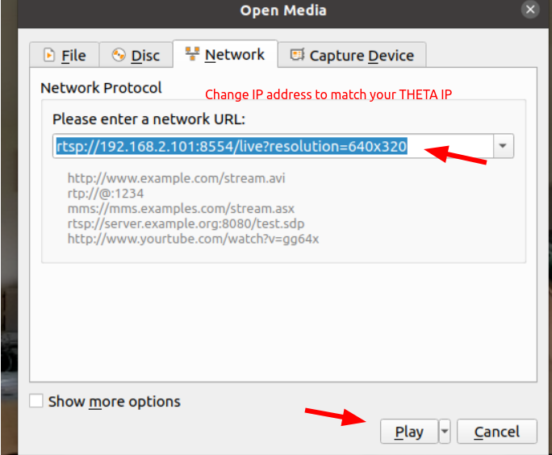
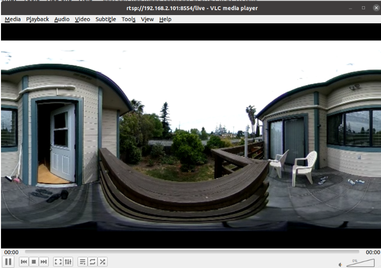

# Overview
This is a Live Streaming Plug-in for the RICOH THETA V and Z1.  It starts an RTSP
server on the THETA.

This software was developed by Science Arts.  The THETA V plug-in is available in the
[plug-in store](https://pluginstore.theta360.com/plugins/com.sciencearts.rtspstreaming/).

## Usage

You can open and play the RTSP Stream from RTSP client tool like VLC.

1. Set RICOH THETA in Wireless LAN client mode.

Video: https://www.youtube.com/watch?v=tkqyBNOWWIY&t=9s
Manual:https://theta360.com/en/support/manual/v/content/prepare/prepare_08.html

2. In the basic app for smartphone, select "Settings" > "Camera settings" and set "THETA RTSP Streaming" in "Plug-in", then tap the icon displayed next to "Starting plug-in".

If the application is launched successfully, video LED on RICOH THETA turns on.

3. Find out and remember the IP Address of RICOH THETA.

i. Open the basic app for smartphone.
ii. select "Setting" > "Camera setting" > "Camera version", then get IP Address.


4. Receive live streaming from RTSP client application like vlc.

vlc live streaming example

i. Open the vlc.
ii. select "Media" > "Open Network Stream", then set a network URL like below.
rtsp://[your RICOH THETA IP Address]:8554/live?resolution=1920x960
You can set a resolution of camera by the parameter which name of "resolution".
You can set the "resolution" to "640x320", "1024x512", "1920x960" or "3840x1920". "3840x1920" may not work because of bandwidth.
iii. If you want to change the resolution, push Stop Playback Button and retry (ii).

### Select App in Settings to set permissions

Using scrcpy or vysor to select the plug-in settings.


### Enable Camera Persmissions

Move the slider switch for Camera permissions.


### Put camera in client mode wifi


### Press and hold mode button to put the Z1 into plug-in mode


### Select plug-in by pressing the shutter button


When the plug-in is running, the 
blue LED on the Z1 body turns aqua.
The OLED shows a puzzle piece.

The USB cable is to supply power to the camera.

### Open Network Stream on VLC


### Set Address and URL of THETA



### View Equirectangular View in VLC



### Adjust resolution to 1920x960 or 3840x1920


---

## Supply Power to Camera

With firmware 1.60.1 on the z1, the camera can stream indefinitely. The current draw is between 0.7A and .9A when streaming at 4K.  The battery is charging.


I am using an inline electrical current meter to monitor the power consumption.

## Possible Issues

I have problems using VLC on Windows.  Linux works fine.

On Ubuntu 20.04 with VLC 3.0.9.2, I have error messages, but the plug-in works fine and I can see the equirectangular view.


---

Original readme in Japanese.

# 開発環境
Android Studio

# インストール
Android Studioを使用し、本アプリケーションをビルドしインストールしてください。

# 準備

1. Vyserなどのデスクトップビューツールを使用して、本アプリケーションのPermissionを許可してください。
1. [SmartPhone app > Basic app](https://support.theta360.com/en/download/)をインストールしてください。

# 使い方

1. THETAカメラの電源ボタンを押し、THETAを起動してください。
1. SmartPhon appより、Thetaを[Wireless-LAN　client mode]((https://support.theta360.com/uk/manual/v/content/prepare/prepare_08.html))に設定してください。（wireless-LAN LEDが緑色に点灯）
1. SmartPhon appの設定 > カメラ設定 > プラグイン　より本プラグインを選択してください。
1. THETAカメラのモードボタンを長押しし、プラグインを起動してください。
1. 正常に起動すると、VIDEO LEDが点灯状態、白色のLEDが点灯状態になります。このとき、RTSPサーバーが起動されています。
1. vlcなどお好みのRTSPクライアントツールよりTHETA RTSP Serverにアクセスしてください。
```
rtsp://[TEATA IP ADDRESS]/live?resolution=1920x960
```

THETA IP ADDRESS: THETAカメラのIPアドレス

THETAカメラのIPアドレスはSmartPhon appより確認できます。

resolution パラメータにて解像度の指定ができます。
640x320,1024x512,1920x960,3840x1920のいづれかを設定できます。
ただし、3840x1920は十分なストリーミングスピードが得られません。

# 注意事項
本RTSPサーバーはユニキャストのみ対応となっています。

resolutionパラメータより、解像度を変更する場合は TEARDOWN リクエスト送信後、新しいrtspセッションを開始するようにしてください。（vlcを使用する場合はStop Play Backボタン押下後、新しいセッションを開始してください。）

